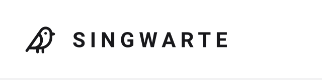

<p align="center">
  
</p>

# Singwarte (BirdNET Analyzer)

A web application for analyzing bird sounds. Upload a file or record audio directly in the
browser to detect bird species with confidence scores and time ranges, tag and annotate the
result, and browse it all later across a dashboard, map, and statistics view. Recordings are
organized into projects, and the UI is fully available in English and German. In the product
itself, the app is branded **Singwarte**.

Singwarte doesn't run its own bird-identification model — it's a web app built on top of the
[BirdNET Analyzer](https://github.com/birdnet-team/BirdNET-Analyzer) inference infrastructure,
developed by the [Cornell Lab of Ornithology](https://www.birds.cornell.edu/home/) and
[Chemnitz University of Technology](https://www.tu-chemnitz.de/). All species identification is
delegated to that project; see [References](#references) for attribution and the services it
runs through.

## About the Name

> **Singwarte** _noun, feminine (die Singwarte) · genitive -, plural -n_
> _Ornithology_: the elevated perch — a branch, wire, or treetop — from which a bird sings to advertise its territory and attract a mate; a song post.

Every recording in the app captures a bird announcing itself from its Singwarte, and each one is GPS-tagged to the spot where it was made — in effect, a map of the song posts the recorded birds are singing from. It's also a deliberate step away from naming the product after the underlying ML model: "Singwarte" isn't just "BirdNET" restated as a brand.

"Singwarte" is the product name across every deployment. The city and organization name shown next to it in the top nav (`VITE_CITY_NAME`, `VITE_ORG_NAME` — see [Configuration](#configuration)) identify the specific instance, so other towns can run their own copy of the same free tool under their own local identity without forking the brand itself.

## Features

- **Dashboard** — at-a-glance stats for the selected project: total recordings, active locations, species detected, a biodiversity index, recording hours, upload success rate, recent activity, and a small map alongside the most recent recordings.
- **Recordings** — upload an audio file or record directly in the browser (WAV, in-browser via `extendable-media-recorder`), attach GPS coordinates and a minimum-confidence threshold, then review past analyses with their per-species detections, and edit tags and notes on each one.
- **Map** — a clustered Leaflet map (OpenStreetMap tiles) of every geolocated recording, with an optional detection-density heatmap overlay.
- **Statistics** — recording frequency, species trends, seasonal comparison, and location-based detection charts for the selected project.
- **Projects** — group recordings under named projects, each with an optional target location that's reverse-geocoded to a city name; switch the active project from the top nav.
- **Settings** — a language toggle (English/German) for the whole UI, also available directly in the top nav.

## References

- [BirdNET-Analyzer](https://github.com/birdnet-team/BirdNET-Analyzer) – upstream analyzer and model definitions.
- [birdnetlib](https://pypi.org/project/birdnetlib/) – Python interface used to drive the analyzer.
- [TensorFlow](https://www.tensorflow.org/) – machine learning runtime leveraged by birdnetlib/BirdNET.
- BirdNET itself is developed by the Cornell Lab of Ornithology and Chemnitz University of Technology; the in-app sidebar links to [birdnet.cornell.edu/analyzer](https://birdnet.cornell.edu/analyzer/) for attribution.

## Architecture

```
Browser  ──▶  Express (TS, :8080)  ──▶  FastAPI (Python, :8000, internal-only)
```

- **Express** owns the public API contract, request validation, and persistence (SQLite via Drizzle) — recording/project metadata and detections only, not the raw audio file.
- **FastAPI** owns BirdNET inference only — stateless, no persistence, no CORS, and never reachable from the browser or a published port. Express is its only caller.
- **`packages/types`** is the single source of truth for API/domain shapes (`Detection`, `Analysis`, `Project`, …), shared by `client` and `server/express-api`.

## Tech Stack

- **Frontend**: React 19 + TypeScript + Vite + Tailwind CSS + shadcn/ui (Radix UI primitives) + TanStack Query + React Router + Recharts (dashboard/statistics charts) + Leaflet/react-leaflet (map, clustering, heatmap) + react-i18next (English/German)
- **Backend**: Express 5 + TypeScript + Drizzle ORM (SQLite via better-sqlite3) + zod request validation + pino structured logging
- **Analyzer**: FastAPI + birdnetlib + TensorFlow (internal-only)
- **Shared types**: `packages/types` (`@birdnet/types`), a workspace package used by both `client` and `server/express-api`
- **Tooling**: npm workspaces, Turborepo, Docker, docker-compose

## Quick Start

### Docker (full parity)

```bash
docker-compose up --build
```

- **Frontend**: http://localhost:3000
- **Express API**: http://localhost:8080
- The FastAPI analyzer is internal-only and not published to the host.

### Local dev (fast iteration, hot reload)

Prerequisites: Node.js 22+, Python 3.13, `ffmpeg` on PATH.

```bash
npm install        # install all workspace deps from repo root
npm start          # launches all three services under Turbo's TUI
```

Or run services individually:

```bash
server/birdnet-api/run.sh                   # FastAPI analyzer — :8000
npm run dev --workspace server/express-api  # Express API — :8080
npm run dev --workspace client              # React dev server — :3000
```

Copy `server/express-api/.env.example` to `server/express-api/.env` before running the Express
API directly (Docker sets the equivalent variables via `docker-compose.yml`). `client/.env.development`
already ships with working local defaults, including `VITE_CITY_NAME`/`VITE_ORG_NAME` for this
deployment.

## Configuration

Each service reads its own configuration — FastAPI takes plain environment variables via
`server/birdnet-api/config.py` (`HOST`, `PORT`, `MAX_FILE_SIZE`, `DEFAULT_MIN_CONFIDENCE`, …),
Express reads `server/express-api/.env` (see `.env.example` for every variable, including
`BIRDNET_API_URL`, `DATABASE_PATH`, and the `GEOCODING_API_URL` reverse-geocoding lookup), and
the client reads `client/.env.development` for `VITE_API_URL` plus the per-deployment
`VITE_CITY_NAME`/`VITE_ORG_NAME` shown in the top nav. The client's variables are baked in at
build time — Vite env vars aren't runtime-configurable.

## Data & Persistence

- SQLite via Drizzle ORM stores three tables: `projects`, `analyses` (recording metadata — filename, size, GPS, reverse-geocoded city, minimum-confidence threshold, status, duration, tags, notes), and `detections` (per-species confidence + time range, one-to-many off each analysis). Default path `server/express-api/data/birdnet.db`.
- The uploaded/recorded audio itself is streamed to a temp file for analysis and deleted immediately afterward, success or failure — there's no blob/object storage, so past recordings can't be played back or re-downloaded. In-browser playback only works for the recording just analyzed in the current session.
- A recording's GPS coordinates are reverse-geocoded to a city name once, at save time, via the Nominatim API (`GEOCODING_API_URL`) — best-effort, and never blocks the save if it fails or times out.
- Configure the database path via `DATABASE_PATH` in `server/express-api/.env`.
- Migrations live in `server/express-api/drizzle/`. Run `npm run db:generate --workspace server/express-api` after changing `src/db/schema.ts`.
- `data/` is git-ignored; docker-compose bind-mounts it so history survives container rebuilds.
- There's no authentication — the app is single-tenant, and the user menu in the top nav is a placeholder guest identity, not a real login.

## Testing

```bash
npm run typecheck   # all TS workspaces
npm run lint         # all TS workspaces
npm run test          # all TS workspaces (Vitest)
npm run build          # all TS workspaces

cd server/birdnet-api && ./venv/bin/pytest   # Python service
```

CI (`.github/workflows/ci.yml`) runs all of the above on every push/PR.

## License

This project's code is licensed under the [PolyForm Noncommercial License 1.0.0](LICENSE) —
free to use, modify, and self-host for personal, research, educational, or nonprofit purposes;
commercial use requires a separate agreement with the copyright holder.

Separately, the BirdNET model itself remains licensed by its authors under the
[Creative Commons Attribution-NonCommercial-ShareAlike 4.0 International](https://creativecommons.org/licenses/by-nc-sa/4.0/)
license — any deployment of this app must stay non-commercial, provide attribution, and preserve
that same license for derivative model artifacts, regardless of the license on this repo's own
code.
